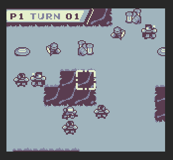
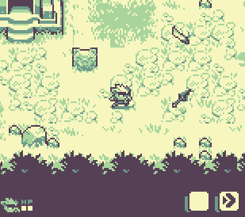
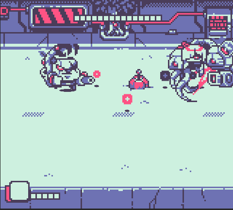
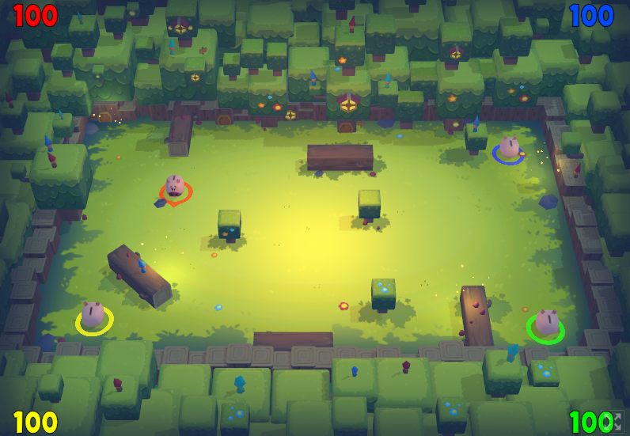
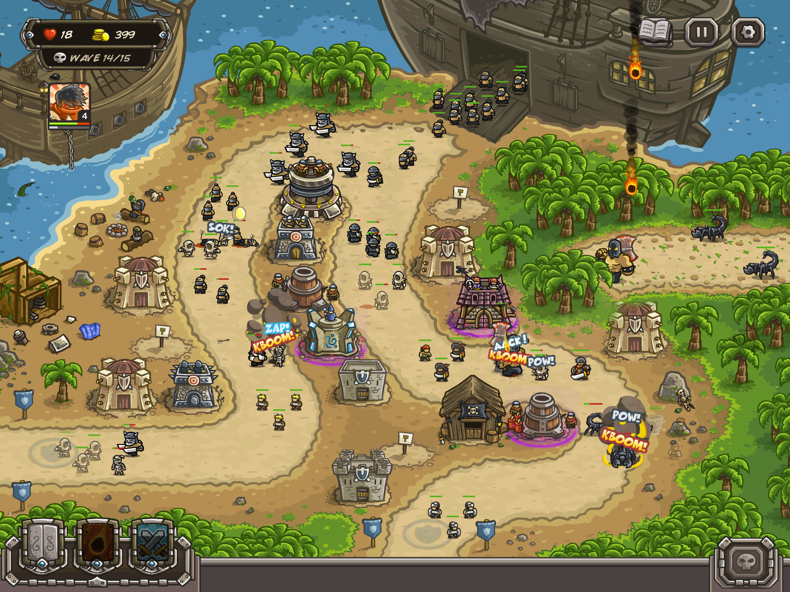
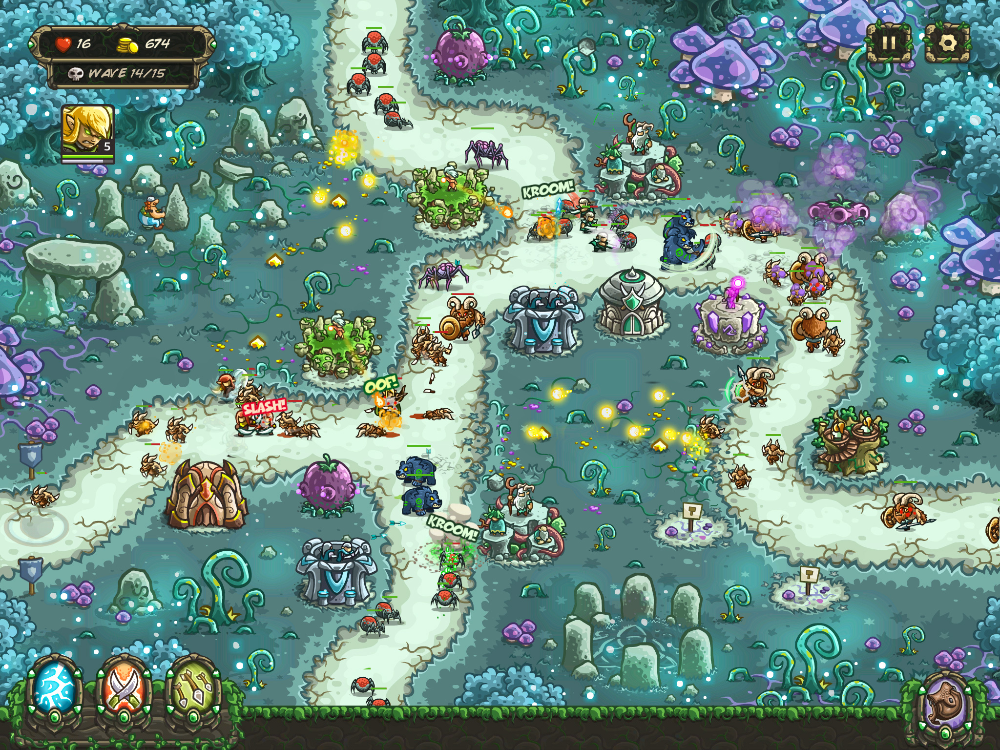
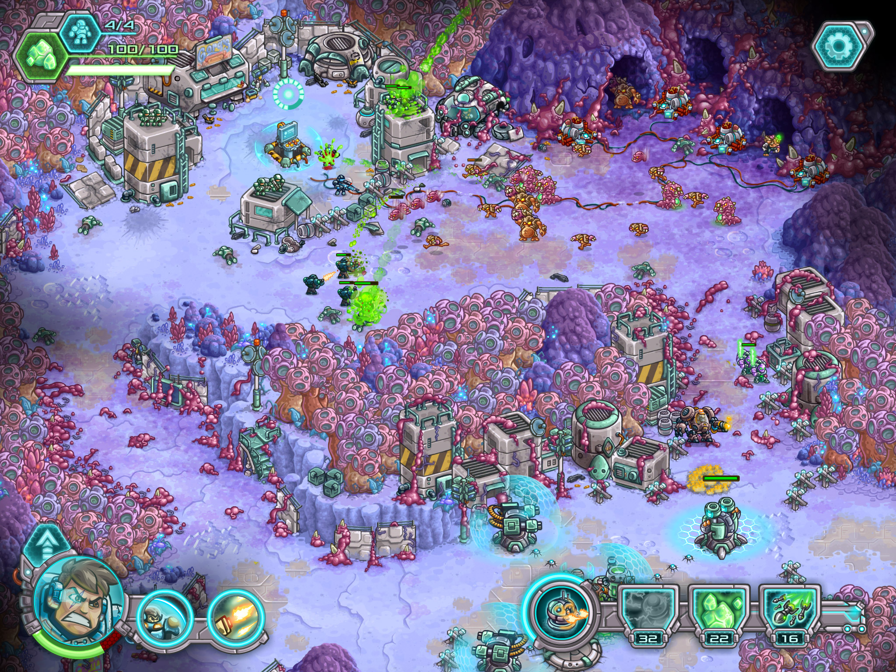
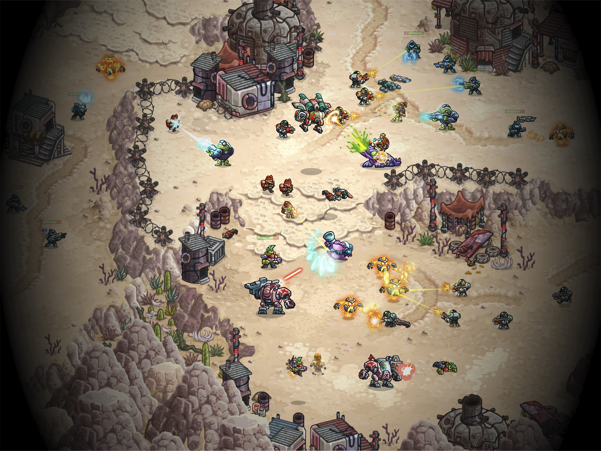
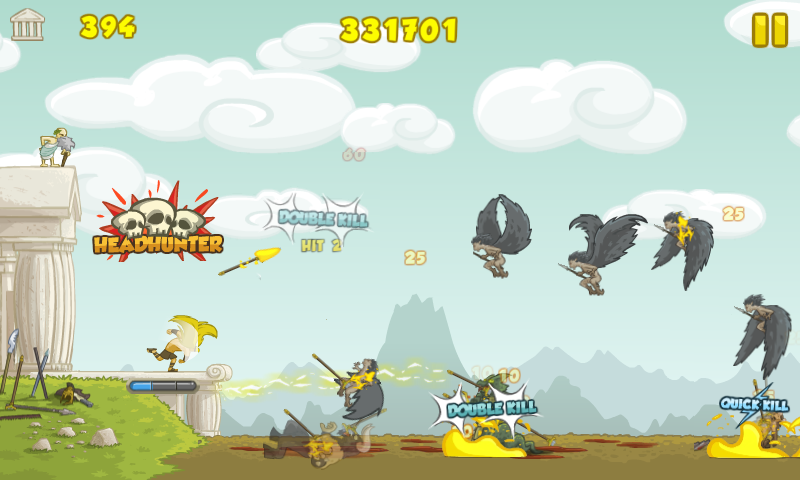

Hi there 👋, I am a professional Game Dev Engineer with passion about game development and programming.

Some of my core values:

* Collaboration, teamwork and growing together.
* Psychological safety by treating others and being treated as pairs and by generating space to talk.
* Continuous improvement and empowerment by listening to each other and removing waste.
* Generate trust by being transparent and having good communication skills.
* I don't believe in separated roles with separated responsibilities but I do believe in having different knowledge and points of view and achieving excellence by interacting to find the best product value from them. 

Some of my development best practices:

* Continuous delivery
* Test driven development
* Pair programming

I love game jams, I have games at [itch.io](https://arielsan.itch.io/) and at [gemserk](https://blog.gemserk.com/games/) website. Here are some examples:

 

I worked at [Ironhide Game Studio](https://www.ironhidegames.com/) as Lead Game Engineer on [Iron Marines Invasion](https://www.ironhidegames.com/Games/ironmarinesinvasion), [Iron Marines](https://www.ironhidegames.com/Games/iron-marines), and as Programmer in some of the [Kingdom Rush](https://www.ironhidegames.com/Games/kingdom-rush-frontiers) game series too. 

 
 
 
 

Previously, I worked at [Gemserk](https://github.com/gemserk) with [rgarat](https://github.com/rgarat) where we created lots of game prototypes using and collaborating with open source projects like LWJGL and [LibGDX](https://github.com/libgdx/libgdx) (among others) and learned a lot. We ended up porting [Clash of the Olympians](https://www.ironhidegames.com/Games/clash-of-the-olympians) to mobile devices. 

 
 

I have some personal open source projects too like a [selection history plugin for Unity](https://github.com/acoppes/unity-history-window).

---

Big fan of git and Github, using it in different projects since it was released I believe, here are my stats which I am super proud of:

     

### Profile Visit Count   

<!--
**acoppes/acoppes** is a ✨ _special_ ✨ repository because its `README.md` (this file) appears on your GitHub profile.

Here are some ideas to get you started:

- 🔭 I’m currently working on ...
- 🌱 I’m currently learning ...
- 👯 I’m looking to collaborate on ...
- 🤔 I’m looking for help with ...
- 💬 Ask me about ...
- 📫 How to reach me: ...
- 😄 Pronouns: ...
- ⚡ Fun fact: ...
-->
